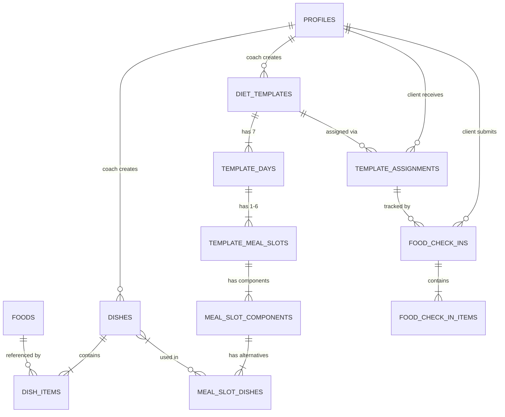

# Design Document: Dishes and Diet Directory

## Overview

This feature introduces a structured, layered nutrition system for the FitCoach platform. It replaces the current flat string-array approach to diet plans with a composable architecture: **Food Items → Dishes → Diet Plan Templates → Client Assignments → Daily Check-ins**.

The system enables coaches to build a reusable library of dishes (recipes), compose those dishes into 7-day weekly diet plan templates with configurable meal slots and component-based organization, assign a template to a client (one active at a time), and track client adherence through structured daily food check-ins.

### Key Design Decisions

1. **Dishes reference food items by ID** — Dishes store `food_id` + `gram_amount` pairs, not denormalized food data. Macro totals are computed on read from current food item values.
2. **Simple one-time assignment** — Coach assigns a template to a client. One active assignment at a time. Coach can swap it manually whenever by deactivating the old and creating a new one. No date ranges, no versioning.
3. **Component-category matching** — Meal slots have typed component positions (carb, protein, fiber). Only dishes with matching `component_category` can be assigned to a position, enforced at the application layer.
4. **Fixed weekly mapping** — The template is a 7-day structure where Day 1 = Sunday, Day 2 = Monday, ..., Day 7 = Saturday. The client sees today's day-of-week meals. No date math needed.
5. **Coexistence with legacy plans** — The new system uses separate tables (`dishes`, `diet_templates`, `template_assignments`, `food_check_ins`). Existing `diet_plans` / `diet_meals` tables remain untouched.
6. **No template versioning** — If a coach edits a template, it updates in place. The client always sees the latest version of their assigned template.

## Architecture

```mermaid
graph TD
    subgraph "Data Layer (Supabase)"
        FOODS[foods table]
        DISHES[dishes table]
        DISH_ITEMS[dish_items table]
        TEMPLATES[diet_templates table]
        TEMPLATE_DAYS[template_days table]
        MEAL_SLOTS[template_meal_slots table]
        SLOT_DISHES[meal_slot_dishes table]
        ASSIGNMENTS[template_assignments table]
        CHECKINS[food_check_ins table]
        CHECKIN_ITEMS[food_check_in_items table]
    end

    subgraph "Application Layer (src/lib)"
        DB[db.ts - CRUD functions]
        CALC[macro-calc.ts - pure calculations]
        TYPES[types/index.ts - TypeScript interfaces]
    end

    subgraph "UI Layer (src/app)"
        COACH_DISHES[/coach/dishes/]
        COACH_TEMPLATES[/coach/diet-templates/]
        COACH_ASSIGN[/coach/diet-templates/assign]
        CLIENT_PLAN[/client/diet-plan/]
        CLIENT_CHECKIN[/client/food-check-in/]
        COACH_ADHERENCE[/coach/clients/id - adherence tab]
    end

    FOODS --> DISH_ITEMS
    DISH_ITEMS --> DISHES
    DISHES --> SLOT_DISHES
    SLOT_DISHES --> MEAL_SLOTS
    MEAL_SLOTS --> TEMPLATE_DAYS
    TEMPLATE_DAYS --> TEMPLATES
    TEMPLATES --> ASSIGNMENTS
    ASSIGNMENTS --> CHECKINS
    CHECKINS --> CHECKIN_ITEMS

    DB --> COACH_DISHES
    DB --> COACH_TEMPLATES
    DB --> CLIENT_PLAN
    DB --> CLIENT_CHECKIN
    CALC --> COACH_DISHES
    CALC --> CLIENT_PLAN
```

### Layer Responsibilities

| Layer | Responsibility |
|-------|---------------|
| **Database (Supabase)** | Storage, RLS policies, referential integrity |
| **Macro Calculation (`macro-calc.ts`)** | Pure functions for macro math — no DB calls, no side effects |
| **DB Functions (`db.ts`)** | CRUD operations following existing patterns (reads return `data \|\| []`, writes return `{ error }`) |
| **UI Pages** | Data fetching, state management, rendering (follows existing Suspense + demo mode patterns) |

## Components and Interfaces

### TypeScript Types (`src/types/index.ts`)

```typescript
// Component categories for dishes
export type ComponentCategory = "carbohydrate" | "protein" | "fiber" | "complete_meal";

// Diet plan template types
export type PlanType = "veg" | "nonveg" | "low_carb_nonveg" | "intermittent_fasting";

// A food item within a dish (standard or custom)
export interface DishItem {
  id: string;
  dishId: string;
  foodId: string | null;       // null = custom food item
  customName?: string;         // only for custom items
  customEmoji?: string;        // only for custom items
  customCalories?: number;     // per 100g, only for custom items
  customProtein?: number;      // per 100g, only for custom items
  customCarbs?: number;        // per 100g, only for custom items
  customFat?: number;          // per 100g, only for custom items
  grams: number;
  sortOrder: number;
}

// A reusable dish (recipe)
export interface Dish {
  id: string;
  coachId: string;
  name: string;
  emoji: string;
  componentCategory: ComponentCategory;
  totalCalories: number;
  totalProtein: number;
  totalCarbs: number;
  totalFat: number;
  items: DishItem[];
  createdAt: string;
}

// A 7-day diet plan template
export interface DietTemplate {
  id: string;
  coachId: string;
  name: string;
  planType: PlanType;
  days: TemplateDay[];
  createdAt: string;
}

// A single day within a template (day 1-7 = Sunday-Saturday)
export interface TemplateDay {
  id: string;
  templateId: string;
  dayNumber: number;           // 1=Sunday, 2=Monday, ..., 7=Saturday
  mealSlots: TemplateMealSlot[];
}

// A meal slot within a day
export interface TemplateMealSlot {
  id: string;
  dayId: string;
  name: string;                // e.g., "Breakfast", "Lunch"
  targetCalories: number | null;
  isSkipped: boolean;          // for intermittent_fasting
  sortOrder: number;
  components: MealSlotComponent[];
}

// A component position within a meal slot
export interface MealSlotComponent {
  id: string;
  slotId: string;
  componentCategory: ComponentCategory;
  sortOrder: number;
  dishes: MealSlotDish[];      // alternatives
}

// A dish option within a component (one of the alternatives)
export interface MealSlotDish {
  id: string;
  componentId: string;
  dishId: string;
  dish?: Dish;                 // populated on read
  sortOrder: number;
}

// Assignment of a template to a client (simple: one active at a time)
export interface TemplateAssignment {
  id: string;
  templateId: string;
  clientId: string;
  coachId: string;
  status: "active" | "inactive";
  template?: DietTemplate;     // populated on read
  createdAt: string;
}

// Daily food check-in
export interface FoodCheckIn {
  id: string;
  clientId: string;
  assignmentId: string;
  date: string;
  totalCalories: number;
  totalProtein: number;
  totalCarbs: number;
  totalFat: number;
  adherenceScore: number;      // 0-100 percentage
  items: FoodCheckInItem[];
  createdAt: string;
}

// Individual selection within a check-in
export interface FoodCheckInItem {
  id: string;
  checkInId: string;
  slotId: string;
  componentId: string;
  dishId: string | null;       // null = skipped
  isSkipped: boolean;
}
```

### Pure Calculation Module (`src/lib/macro-calc.ts`)

```typescript
export interface MacroValues {
  calories: number;
  protein: number;
  carbs: number;
  fat: number;
}

// Calculate macro contribution of a single food item at a given gram amount
export function calculateItemMacros(per100g: MacroValues, grams: number): MacroValues;

// Sum macros across multiple items to get dish total
export function calculateDishMacros(items: { per100g: MacroValues; grams: number }[]): MacroValues;

// Round macro values for display
export function roundMacros(macros: MacroValues): MacroValues;

// Calculate daily macro total from selected dishes
export function calculateDailyMacros(selectedDishes: Dish[]): MacroValues;

// Calculate adherence score
export function calculateAdherenceScore(
  components: { componentId: string; prescribedDishIds: string[] }[],
  selections: { componentId: string; dishId: string | null; isSkipped: boolean }[],
  isIntermittentFasting: boolean,
  skippedSlotIds: string[]
): number;

// Calculate weekly adherence average
export function calculateWeeklyAdherence(dailyScores: number[]): number;

// Get the template day number (1-7) for a given day of the week
// Uses JS Date.getDay() where 0=Sunday → dayNumber 1, 1=Monday → dayNumber 2, etc.
export function getTemplateDayForDate(date: Date): number;
```

### Database Functions (additions to `src/lib/db.ts`)

```typescript
// ---- Dishes ----
export async function getDishes(coachId: string): Promise<Dish[]>;
export async function getDish(dishId: string): Promise<Dish | null>;
export async function createDish(dish: CreateDishInput): Promise<{ error: string | null; dishId?: string }>;
export async function updateDish(dishId: string, dish: UpdateDishInput): Promise<{ error: string | null }>;
export async function deleteDish(dishId: string): Promise<{ error: string | null }>;
export async function getDishReferences(dishId: string): Promise<{ templateName: string; templateId: string }[]>;

// ---- Diet Templates ----
export async function getDietTemplates(coachId: string): Promise<DietTemplate[]>;
export async function getDietTemplate(templateId: string): Promise<DietTemplate | null>;
export async function createDietTemplate(template: CreateTemplateInput): Promise<{ error: string | null; templateId?: string }>;
export async function updateDietTemplate(templateId: string, template: UpdateTemplateInput): Promise<{ error: string | null }>;
export async function deleteDietTemplate(templateId: string): Promise<{ error: string | null }>;

// ---- Template Assignments ----
export async function getClientActiveAssignment(clientId: string): Promise<TemplateAssignment | null>;
export async function assignTemplate(input: { templateId: string; clientId: string; coachId: string }): Promise<{ error: string | null }>;
export async function deactivateAssignment(assignmentId: string): Promise<{ error: string | null }>;
export async function getCoachAssignments(coachId: string): Promise<TemplateAssignment[]>;

// ---- Food Check-ins ----
export async function getFoodCheckIn(clientId: string, date: string): Promise<FoodCheckIn | null>;
export async function createFoodCheckIn(checkIn: CreateFoodCheckInInput): Promise<{ error: string | null }>;
export async function getClientFoodCheckIns(clientId: string, limit?: number): Promise<FoodCheckIn[]>;
export async function getCoachClientAdherence(coachId: string, clientId: string): Promise<FoodCheckIn[]>;
```

## Data Models

### Database Schema (new tables)

```sql
-- ============================================================
-- DISHES — reusable recipes composed of food items
-- ============================================================
create table dishes (
  id uuid primary key default gen_random_uuid(),
  created_at timestamptz default now(),
  coach_id uuid not null references profiles(id),
  name text not null,
  emoji text default '🍽️',
  component_category text not null check (component_category in ('carbohydrate', 'protein', 'fiber', 'complete_meal')),
  total_calories numeric default 0,
  total_protein numeric default 0,
  total_carbs numeric default 0,
  total_fat numeric default 0
);

-- ============================================================
-- DISH ITEMS — food items within a dish
-- ============================================================
create table dish_items (
  id uuid primary key default gen_random_uuid(),
  created_at timestamptz default now(),
  dish_id uuid not null references dishes(id) on delete cascade,
  food_id uuid references foods(id),          -- null for custom items
  custom_name text,                            -- only for custom items
  custom_emoji text,
  custom_calories numeric,                     -- per 100g
  custom_protein numeric,                      -- per 100g
  custom_carbs numeric,                        -- per 100g
  custom_fat numeric,                          -- per 100g
  grams numeric not null,
  sort_order integer default 0
);

-- ============================================================
-- DIET TEMPLATES — 7-day weekly plan templates (no versioning)
-- ============================================================
create table diet_templates (
  id uuid primary key default gen_random_uuid(),
  created_at timestamptz default now(),
  coach_id uuid not null references profiles(id),
  name text not null,
  plan_type text not null check (plan_type in ('veg', 'nonveg', 'low_carb_nonveg', 'intermittent_fasting'))
);

-- ============================================================
-- TEMPLATE DAYS — one row per day (7 per template)
-- Day 1=Sunday, 2=Monday, ..., 7=Saturday
-- ============================================================
create table template_days (
  id uuid primary key default gen_random_uuid(),
  template_id uuid not null references diet_templates(id) on delete cascade,
  day_number integer not null check (day_number between 1 and 7),
  unique (template_id, day_number)
);

-- ============================================================
-- TEMPLATE MEAL SLOTS — meal occasions within a day
-- ============================================================
create table template_meal_slots (
  id uuid primary key default gen_random_uuid(),
  day_id uuid not null references template_days(id) on delete cascade,
  name text not null,
  target_calories numeric,
  is_skipped boolean default false,
  sort_order integer default 0
);

-- ============================================================
-- MEAL SLOT COMPONENTS — component positions within a slot
-- ============================================================
create table meal_slot_components (
  id uuid primary key default gen_random_uuid(),
  slot_id uuid not null references template_meal_slots(id) on delete cascade,
  component_category text not null check (component_category in ('carbohydrate', 'protein', 'fiber', 'complete_meal')),
  sort_order integer default 0
);

-- ============================================================
-- MEAL SLOT DISHES — dish alternatives within a component
-- ============================================================
create table meal_slot_dishes (
  id uuid primary key default gen_random_uuid(),
  component_id uuid not null references meal_slot_components(id) on delete cascade,
  dish_id uuid not null references dishes(id),
  sort_order integer default 0
);

-- ============================================================
-- TEMPLATE ASSIGNMENTS — simple one-active-at-a-time link
-- ============================================================
create table template_assignments (
  id uuid primary key default gen_random_uuid(),
  created_at timestamptz default now(),
  template_id uuid not null references diet_templates(id),
  client_id uuid not null references profiles(id),
  coach_id uuid not null references profiles(id),
  status text not null default 'active' check (status in ('active', 'inactive'))
);

-- ============================================================
-- FOOD CHECK-INS — daily food logging by client
-- ============================================================
create table food_check_ins (
  id uuid primary key default gen_random_uuid(),
  created_at timestamptz default now(),
  client_id uuid not null references profiles(id),
  assignment_id uuid not null references template_assignments(id),
  date date not null default current_date,
  total_calories numeric default 0,
  total_protein numeric default 0,
  total_carbs numeric default 0,
  total_fat numeric default 0,
  adherence_score numeric default 0,
  unique (client_id, date)
);

-- ============================================================
-- FOOD CHECK-IN ITEMS — individual selections per component
-- ============================================================
create table food_check_in_items (
  id uuid primary key default gen_random_uuid(),
  check_in_id uuid not null references food_check_ins(id) on delete cascade,
  slot_id uuid not null references template_meal_slots(id),
  component_id uuid not null references meal_slot_components(id),
  dish_id uuid references dishes(id),          -- null if skipped
  is_skipped boolean default false
);
```

### RLS Policies (summary)

| Table | Coach Access | Client Access |
|-------|-------------|---------------|
| `dishes` | Full CRUD on own (`coach_id = auth.uid()`) | None (accessed via template) |
| `dish_items` | Via parent dish coach_id | None |
| `diet_templates` | Full CRUD on own | Read via assignment |
| `template_days` | Via parent template | Read via assignment |
| `template_meal_slots` | Via parent template | Read via assignment |
| `meal_slot_components` | Via parent template | Read via assignment |
| `meal_slot_dishes` | Via parent template | Read via assignment |
| `template_assignments` | Full CRUD on own | Read own (`client_id = auth.uid()`) |
| `food_check_ins` | Read for own clients | Full CRUD on own |
| `food_check_in_items` | Read for own clients | Via parent check-in |

### Entity Relationship Diagram




## Correctness Properties

*A property is a characteristic or behavior that should hold true across all valid executions of a system — essentially, a formal statement about what the system should do. Properties serve as the bridge between human-readable specifications and machine-verifiable correctness guarantees.*

### Property 1: Dish Macro Calculation Correctness

*For any* dish containing any combination of standard food items (referenced by ID with per-100g values) and custom food items (with inline per-100g values), each with a positive gram amount, the dish's total macros (calories, protein, carbs, fat) SHALL equal the sum of `(grams / 100) * per_100g_value` for each constituent item, rounded to the nearest whole number.

**Validates: Requirements 1.1, 1.3, 1.4, 8.1, 9.1**

### Property 2: Invalid Dish Rejection

*For any* dish submission where the name is empty/whitespace-only OR the food items list is empty OR the component_category is not one of {carbohydrate, protein, fiber, complete_meal}, the system SHALL reject the creation and the dishes collection SHALL remain unchanged.

**Validates: Requirements 1.2, 1.5**

### Property 3: Dish Search Filter Correctness

*For any* set of dishes and any search query (by name substring or component category filter), all returned dishes SHALL match the query criteria, and no dish matching the criteria SHALL be excluded from results.

**Validates: Requirements 2.5**

### Property 4: Meal Slot Count Constraint

*For any* template day configuration, the system SHALL accept only between 1 and 6 meal slots (inclusive). Configurations with 0 or more than 6 slots SHALL be rejected.

**Validates: Requirements 3.2**

### Property 5: Dish-Component Category Matching

*For any* dish assignment to a meal slot component, the assignment SHALL succeed only if the dish's `component_category` matches the component's `component_category`, OR the dish's category is `complete_meal` (which can be placed in any component position).

**Validates: Requirements 3.3**

### Property 6: Template Completeness Validation

*For any* 7-day template, the system SHALL allow saving only when every day (1-7) has at least one meal slot containing at least one component with at least one dish assigned. Days where all slots are marked as `is_skipped = true` (intermittent_fasting plan type only) are exempt from the dish requirement.

**Validates: Requirements 3.5, 3.7**

### Property 7: Single Active Assignment Invariant

*For any* client, at any point in time, there SHALL be at most one template assignment with `status = 'active'`. When a new assignment is created, any previously active assignment for that client SHALL be set to `inactive` first.

**Validates: Requirements 5.2**

### Property 8: Adherence Score Calculation

*For any* daily food check-in, the adherence score SHALL equal `(adherent_components / total_components) * 100` where a component is adherent if the client selected one of the prescribed dish alternatives for that component. A skipped component counts as non-adherent UNLESS the plan type is `intermittent_fasting` AND the corresponding meal slot is marked as `is_skipped` in the template.

**Validates: Requirements 7.2, 7.3**

### Property 9: Weekly Adherence Average

*For any* set of daily adherence scores over a period, the weekly adherence summary SHALL equal the arithmetic mean of those daily scores. If fewer than 7 days have check-ins, the average SHALL be computed over only the days with submissions.

**Validates: Requirements 7.4**

### Property 10: Macro Associativity

*For any* meal slot containing multiple dishes, summing each dish's pre-calculated total macros SHALL produce the same result (within rounding tolerance of ±1 per macro field) as summing all individual food item contributions across all dishes directly.

**Validates: Requirements 8.4**

## Error Handling

### Write Operation Errors

All new DB functions follow the existing pattern: return `{ error: string | null }`.

| Operation | Possible Errors | Handling |
|-----------|----------------|----------|
| Create dish | Missing name, no items, invalid category | Client-side validation + DB constraint |
| Delete dish | Referenced by active template | Check references first, show warning with template names |
| Create template | Incomplete days, invalid plan_type | Client-side validation before save |
| Assign template | Client already has active assignment | Deactivate old assignment first, then create new |
| Submit food check-in | No active assignment | Show "no plan assigned" state |
| Deactivate assignment | Assignment not found | Return error |

### Read Operation Errors

Following existing pattern: errors are silently swallowed, return `data || []` or `null`.

### Demo Mode

All new pages support `?demo=true`:
- Dishes directory shows hardcoded demo dishes
- Template view shows a sample 7-day plan
- Food check-in shows a pre-filled sample day
- No Supabase calls in demo mode

### Edge Cases

- **Food item deleted from `foods` table**: `dish_items` with that `food_id` will have a broken FK. Mitigation: `foods` deletion is restricted (existing RLS prevents deleting default foods; coach-added foods should check dish_items references before deletion).
- **Client views plan after assignment deactivated**: Show "no active plan" state, prompt to contact coach.
- **Multiple check-ins same day**: Prevented by unique constraint `(client_id, date)` on `food_check_ins`. UI uses upsert pattern.
- **Template edited while client has active assignment**: Client sees updated template immediately (no versioning). Coach is aware of this — it's the intended simple behavior.

## Testing Strategy

### Property-Based Testing

This feature has significant pure calculation logic (macro computation, adherence scoring, validation) that is well-suited to property-based testing.

**Library**: [fast-check](https://github.com/dubzzz/fast-check) (TypeScript PBT library)

**Configuration**:
- Minimum 100 iterations per property test
- Each test tagged with: `Feature: dishes-and-diet-directory, Property {N}: {title}`

**Properties to implement as PBT**:
1. Macro calculation correctness (Property 1)
2. Invalid dish rejection (Property 2)
3. Dish search filter correctness (Property 3)
4. Meal slot count constraint (Property 4)
5. Dish-component category matching (Property 5)
6. Template completeness validation (Property 6)
7. Single active assignment invariant (Property 7)
8. Adherence score calculation (Property 8)
9. Weekly adherence average (Property 9)
10. Macro associativity (Property 10)

### Unit Tests (Example-Based)

- Complete_meal dishes accept items from any food category (Req 1.6)
- Dish deletion blocked when referenced by active template (Req 2.4)
- Intermittent fasting slots can be marked as skipped (Req 3.7)
- Custom food items stored inline in dish, not in foods table (Req 9.2)
- Check-in reminder shown when no check-in exists for today (Req 6.6)
- Day-of-week mapping: Sunday=1, Monday=2, ..., Saturday=7 (Req 5.3, 6.1)
- Assigning a new template deactivates the old one (Req 5.2)

### Integration Tests

- Full dish creation flow: create dish → verify in DB → edit → verify macros updated
- Template assignment flow: create template → assign to client → verify client can read
- Food check-in flow: submit check-in → verify adherence calculated → coach can view
- Reassignment flow: assign template A → assign template B → verify A is inactive, B is active

### Test File Structure

```
src/lib/__tests__/
├── macro-calc.test.ts          # Property tests for pure calculation functions
├── macro-calc.unit.test.ts     # Example-based edge cases
├── template-logic.test.ts      # Property tests for validation (slots, completeness, category matching)
├── adherence.test.ts           # Property tests for adherence scoring
└── assignment.test.ts          # Property tests for single-active-assignment invariant
```

### Test Runner

Since no test framework exists, the implementation tasks should set up:
- **Vitest** as the test runner (fast, TypeScript-native, compatible with Next.js)
- **fast-check** for property-based testing
- `vitest.config.ts` at repo root
