# Client Guide

Everything you need to know about using the app.

---

## 1. Home Screen

Your home screen shows your assigned plans and quick actions.

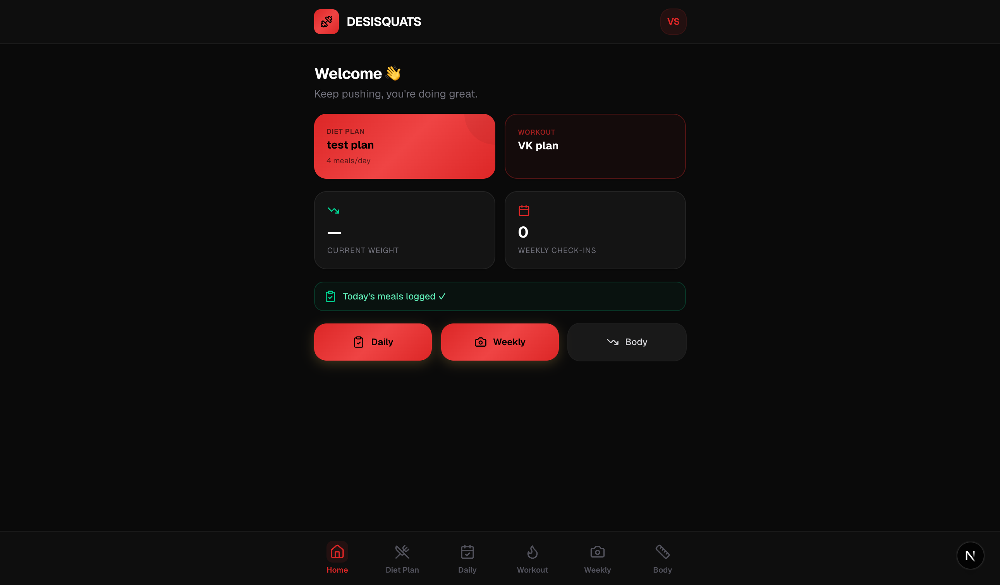

- **Diet Plan card** — tap to see your full meal plan
- **Workout card** — tap to see today's exercises
- **Stats** — your current weight and check-in count
- **Quick buttons** — Daily (log food), Weekly (photo check-in), Body (measurements)

---

## 2. Onboarding

When you first join, your coach will ask you to fill out a questionnaire. This helps them build the perfect plan for you.

### Step 1: Profile
Basic info — name, age, height, city, current weight.

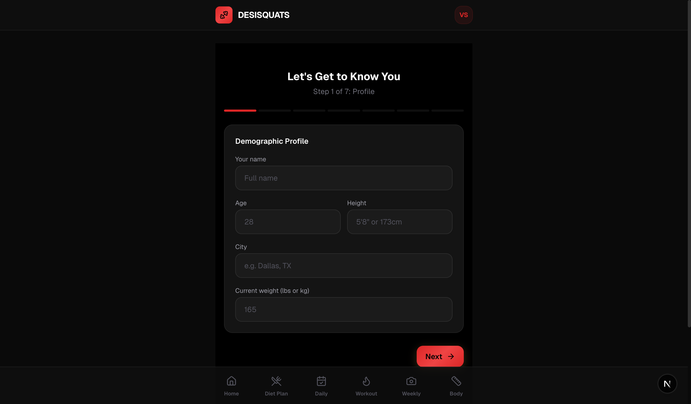

### Step 2: Goals
Your fitness goal (fat loss, muscle gain, or both), target weight, medical conditions, gym access, and work situation.

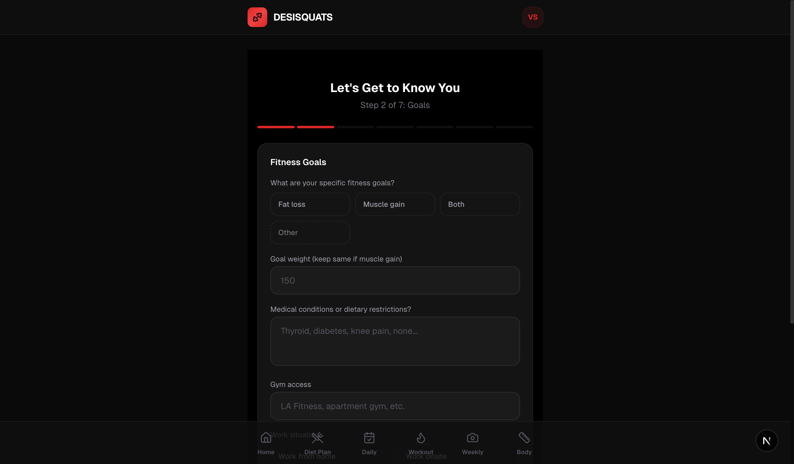

### Step 3: Lifestyle
Your daily routine, weekends, sleep schedule, energy levels, and step count.

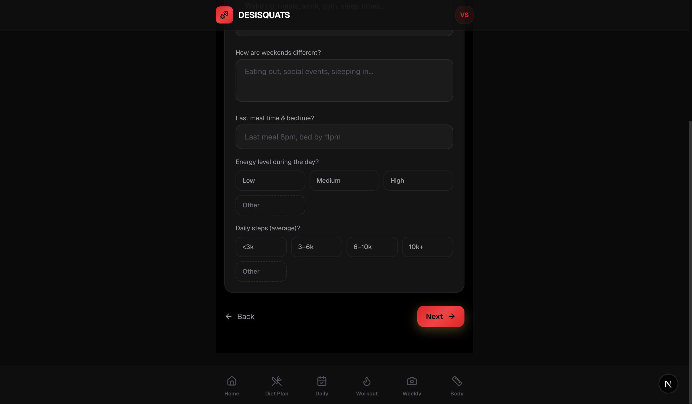

### Step 4: Diet Type
Whether you're vegetarian/non-veg, which proteins and dals you enjoy.

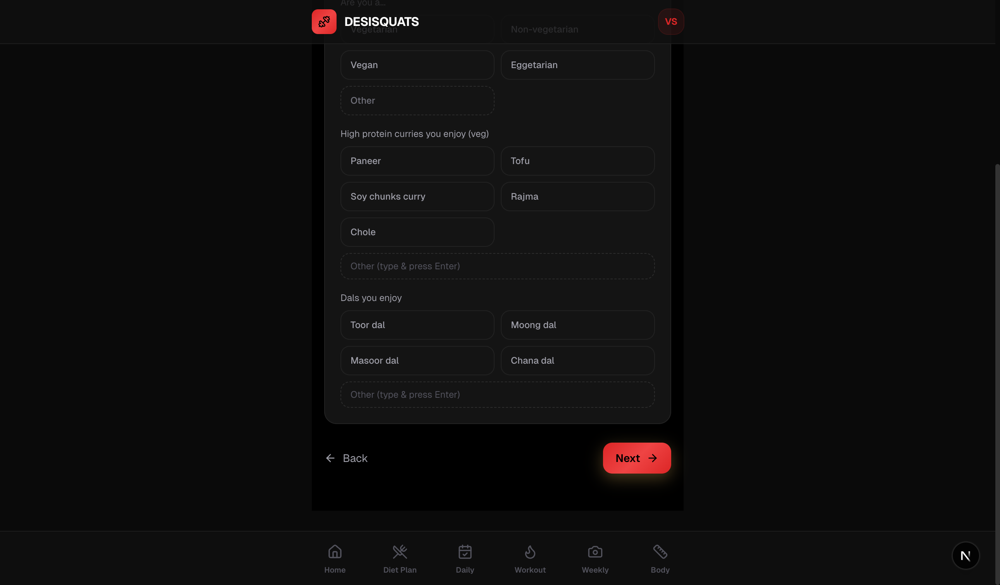

### Step 5: Food Preferences
Vegetables, carbs, and fruits you eat weekly. Snack preference (sweet vs savory).

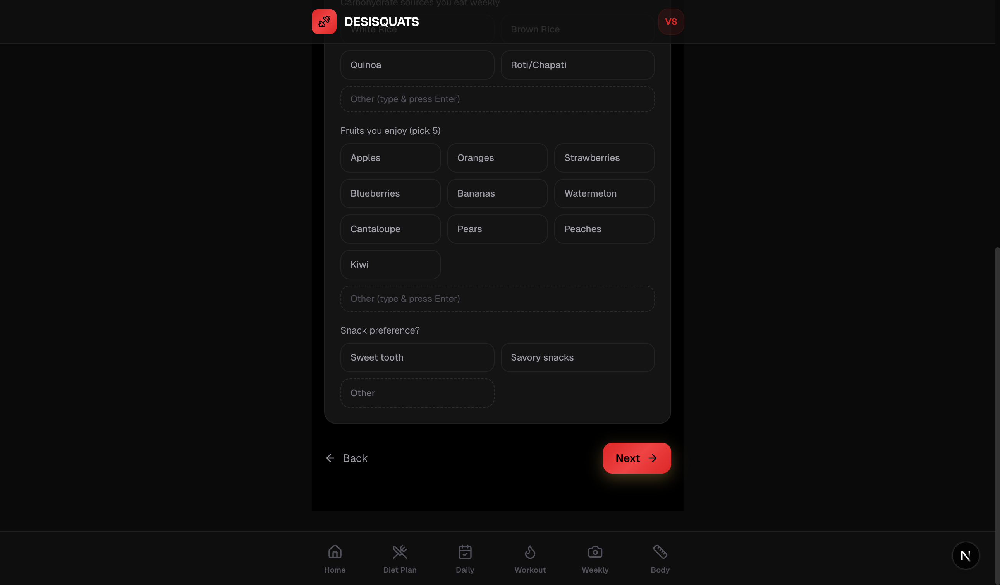

### Step 6: Habits
Chai/coffee, alcohol, eating out frequency, fast food spots, protein supplements, cravings, and breakfast habits.

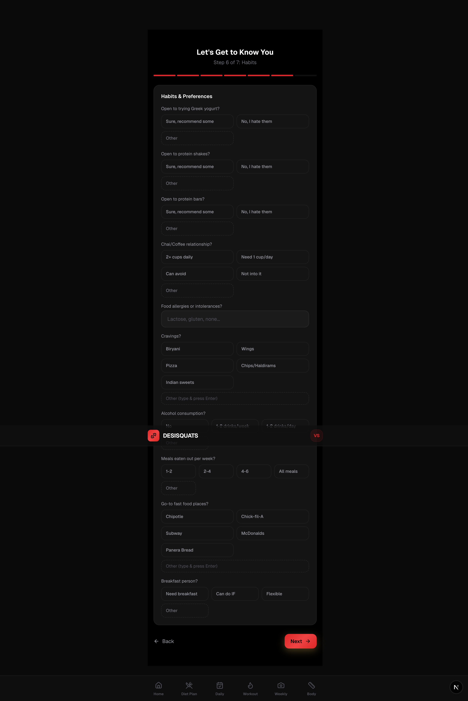

### Step 7: About You
Weight history, coaching style preference, biggest struggle, cooking comfort, motivation, and anything else your coach should know.

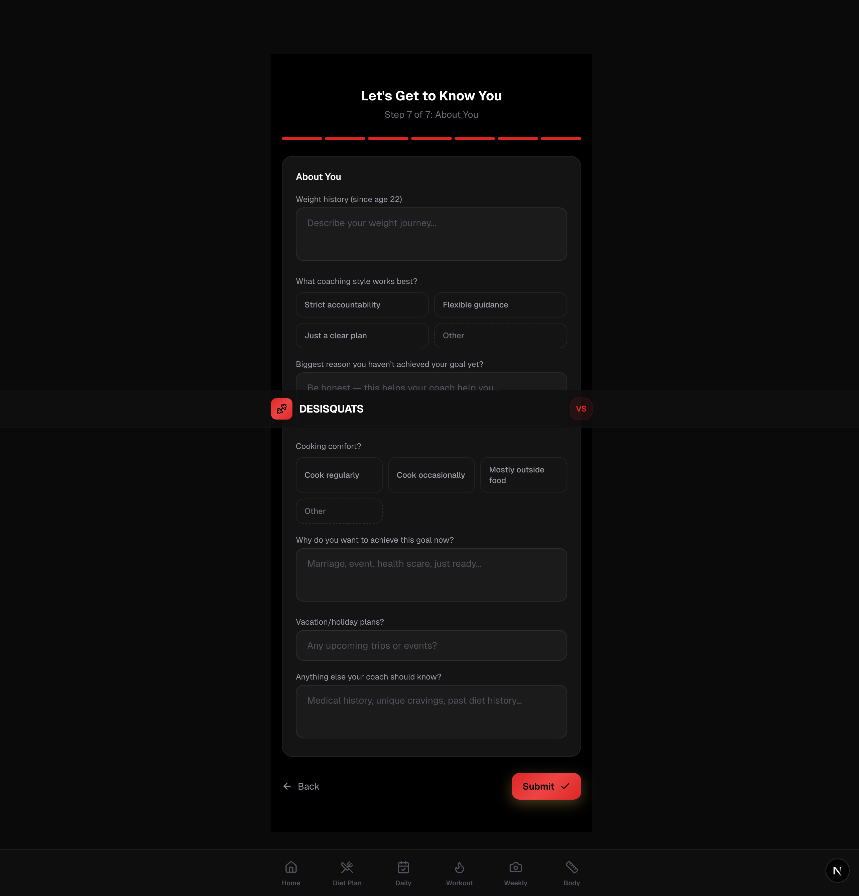

**Tips:**
- Be honest — your coach uses this to build a plan you'll actually enjoy
- Every question with options also has an "Other" field where you can type your own answer
- You can update your answers anytime from your Profile page

---

## 3. Diet Plan

Your coach assigns you a personalized diet plan. Tap **Diet Plan** in the bottom nav to see it.

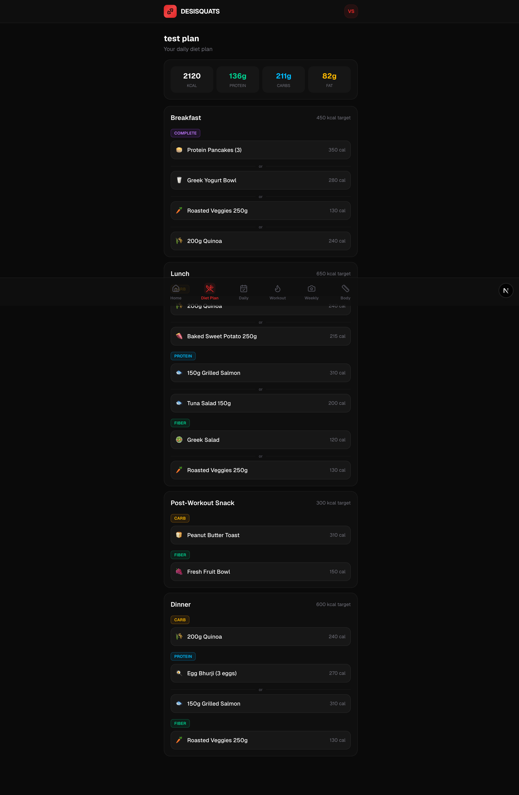

Each meal shows:
- **Category badges** (CARB, PROTEIN, FIBER, COMPLETE) — what type of food
- **Dish options** — tap-friendly rows with emoji, name, and calories
- **"or"** between options — you pick one from each category

The macro summary at the top shows your daily targets (calories, protein, carbs, fat).

---

## 4. Daily Check-in

This is where you log what you actually ate today. Tap **Daily** in the bottom nav.

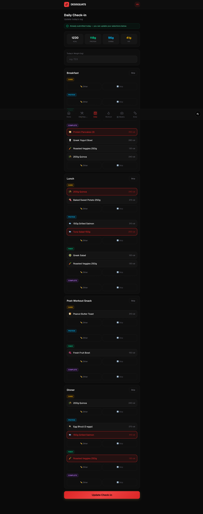

For each meal:
1. **Select the dish you ate** — it highlights in gold when selected
2. **"Other"** — if you ate something not on the plan, tap Other and type what it was + calories
3. **"Skip"** — if you skipped that component entirely

Also enter your **weight** at the top (optional but helpful for tracking).

When done, tap **Submit Check-in**. Your coach will see exactly what you ate, your macros, and your adherence score.

You can update your check-in anytime during the day — just come back and change your selections.

---

## 5. Workout

Your coach assigns you a workout plan. Tap **Workout** in the bottom nav.

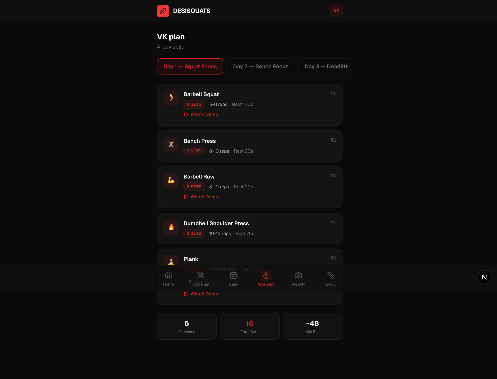

- **Day tabs** at the top — switch between workout days (e.g., Squat Focus, Bench Focus)
- **Exercise cards** — each shows the exercise name, sets, reps, rest time, and notes
- **Watch Demo** links — tap to see a video of the exercise
- **Summary** at the bottom — total exercises, sets, and estimated time

---

## 6. Weekly Check-in

Once a week, submit progress photos and your weight. Tap **Weekly** in the bottom nav.

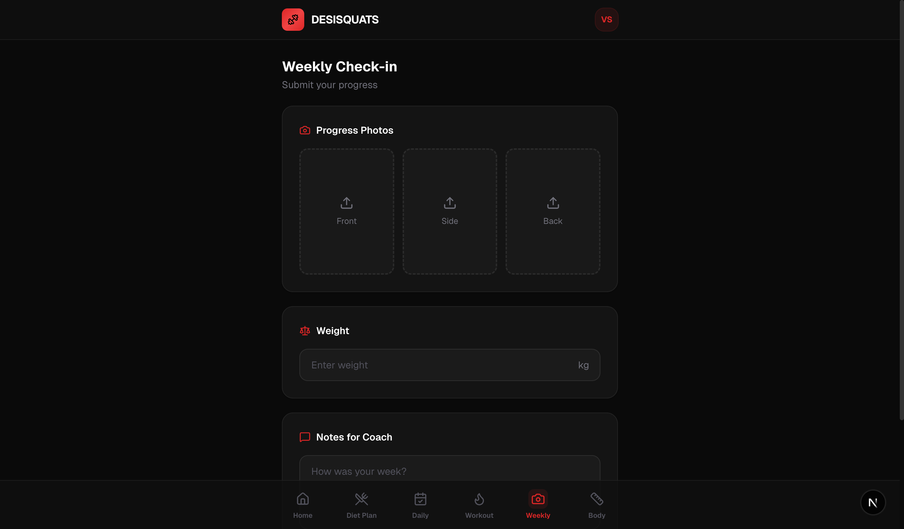

Upload 3 photos (front, side, back), enter your weight, and add any notes for your coach. Your coach reviews these and may leave feedback.

---

## 7. Profile

Tap your avatar (top right corner) to see your profile.

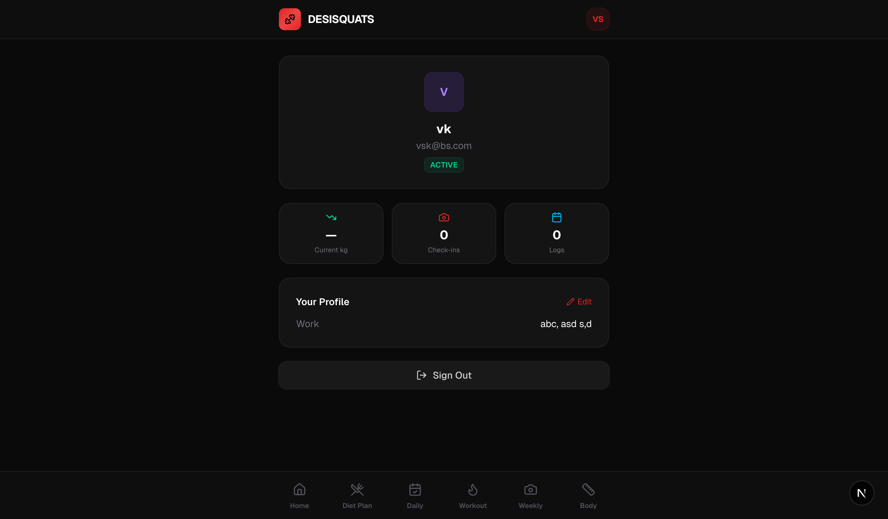

Here you can:
- See your stats (weight, check-ins, logs)
- View/edit your onboarding answers
- Sign out

---

## Bottom Navigation

| Tab | What it does |
|-----|-------------|
| Home | Overview + quick actions |
| Diet Plan | View your assigned meal plan |
| Daily | Log what you ate today |
| Workout | View today's exercises |
| Weekly | Submit weekly progress photos |
| Body | Log body measurements |
