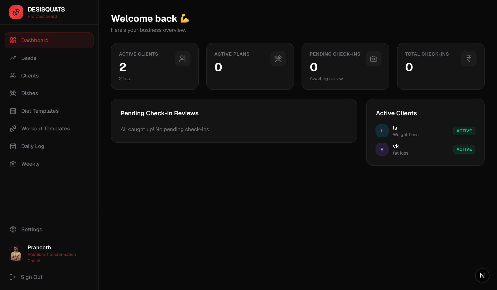
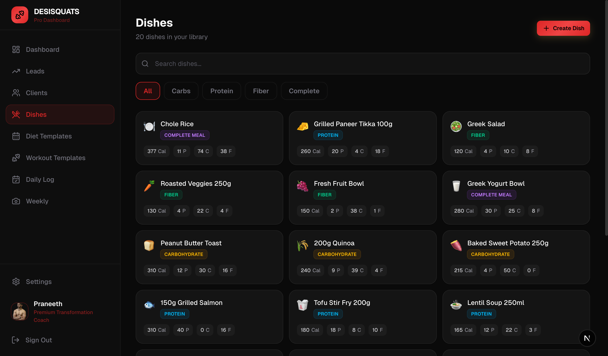
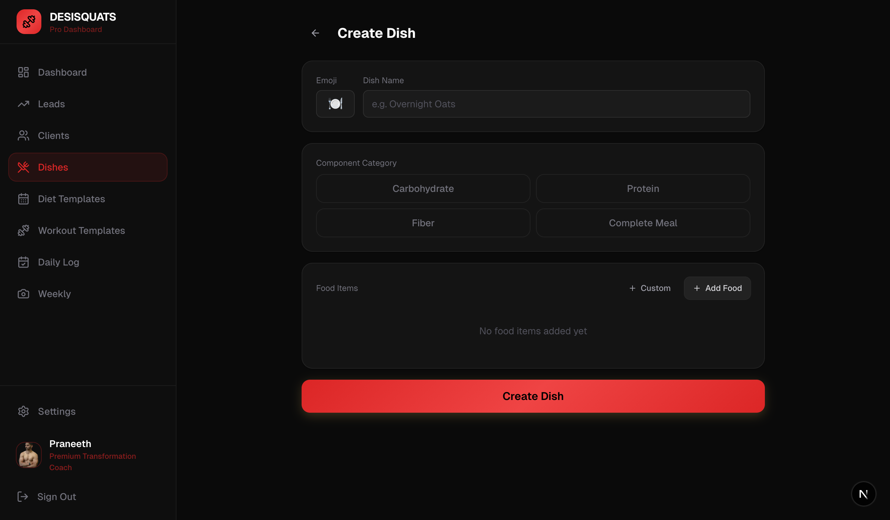
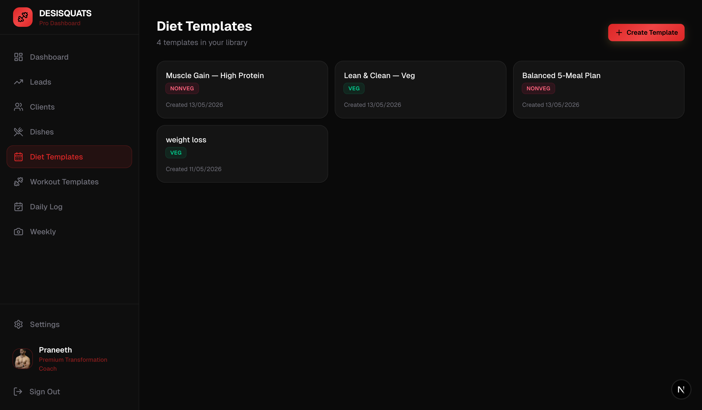
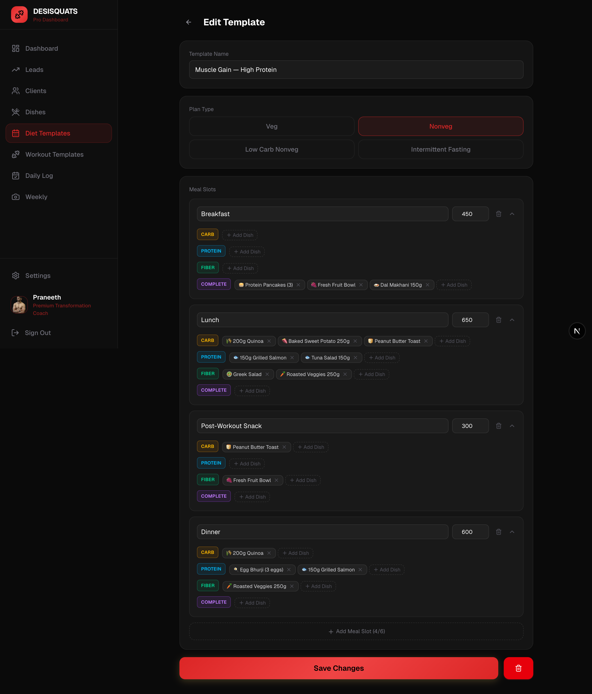
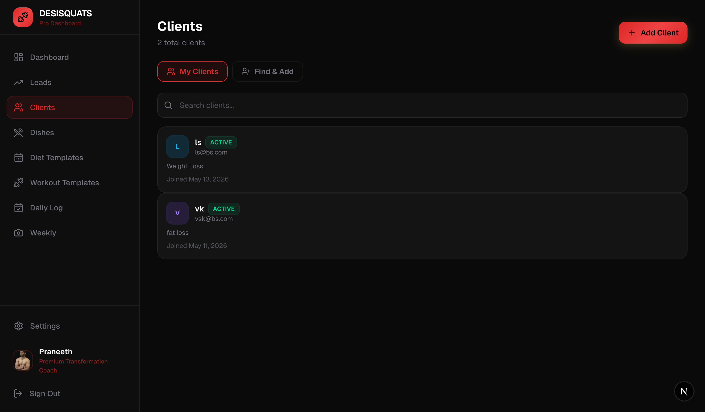
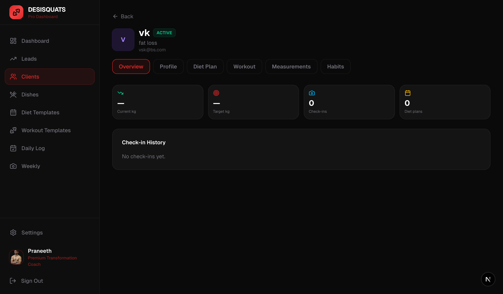
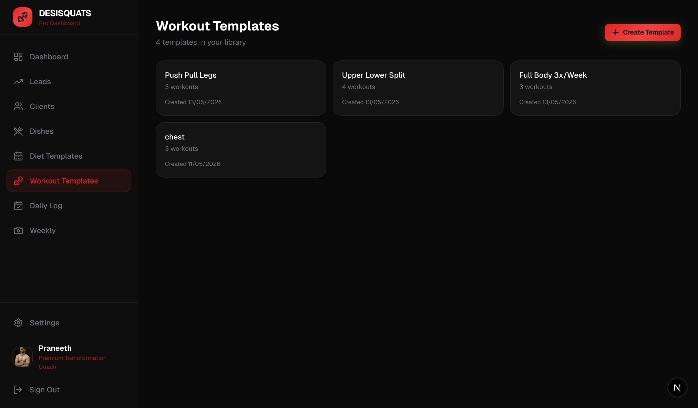
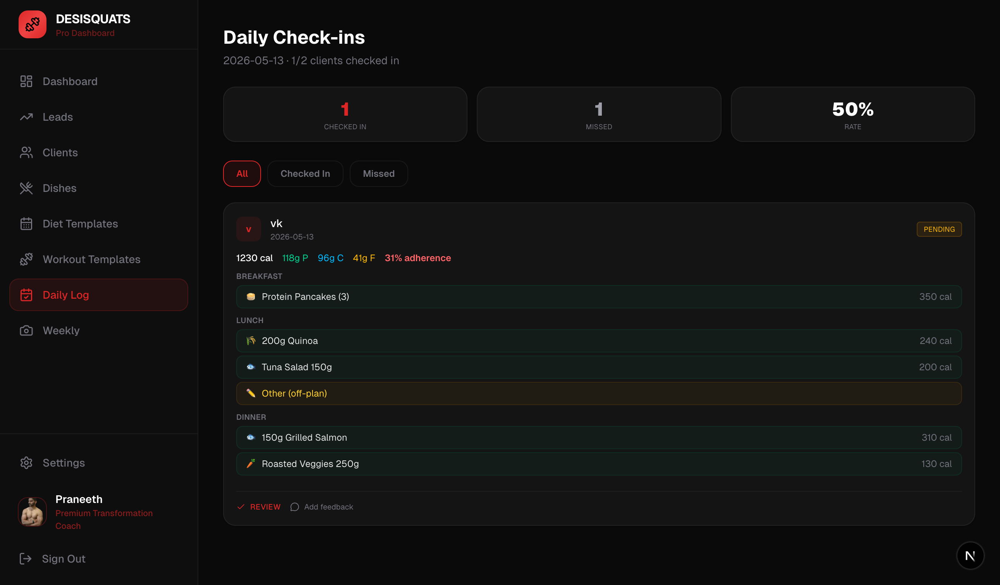

# Coach Guide

A step-by-step guide to managing your coaching business.

---

## 1. Dashboard

Your home base. Shows active clients, pending check-ins, and a quick overview of your business.

---

## 2. Creating Dishes

Dishes are the building blocks of everything. A dish is a recipe with fixed portions and auto-calculated macros.

### Your Dish Library

Go to **Dishes** in the sidebar. You'll see all your dishes with their category, calories, protein, carbs, and fat.

You can filter by category (Carbs, Protein, Fiber, Complete) and search by name.

### Creating a New Dish

Click **Create Dish**. Fill in:

1. **Emoji** — visual identifier
2. **Dish Name** — include the portion size (e.g., "200g Quinoa", "Grilled Paneer 100g")
3. **Category** — what nutritional role this dish plays:
   - **Carbohydrate** — rice, roti, quinoa, bread
   - **Protein** — chicken, paneer, dal, eggs, fish
   - **Fiber** — vegetables, fruits, salads
   - **Complete Meal** — contains all macros (oats, smoothies, biryani)
4. **Food Items** — add ingredients with gram amounts. Use "Add Food" to search the database or "Custom" to enter your own.

**Tips:**
- Different portions = different dishes ("200g Rice" and "150g Rice" are separate)
- Always include the amount in the name
- Macros are auto-calculated from ingredients

---

## 3. Diet Templates

Templates are reusable meal plans. Build them once, assign to multiple clients.

### Template Library

Go to **Diet Templates**. You'll see all your templates with their plan type and creation date.

### Building a Template

Click a template to edit, or **Create Template** for a new one.

Each template has:
- **Name** — e.g., "Muscle Gain — High Protein"
- **Plan Type** — Veg, Nonveg, Low Carb, or Intermittent Fasting
- **Meal Slots** — Breakfast, Lunch, Snack, Dinner (up to 6)

Each meal slot has **component rows** (CARB, PROTEIN, FIBER, COMPLETE). Click **+ Add Dish** to add dishes to a component. Multiple dishes in the same row = alternatives the client can choose from.

---

## 4. Managing Clients

### Client List

Go to **Clients** to see all your clients with their status, goal, and join date.

### Adding a Client

Click **Add Client**. Enter their name, email, and goal. They'll receive login credentials.

### Client Detail Page

Click any client to see their full profile with tabs:

- **Overview** — weight, check-in count, progress chart
- **Profile** — onboarding questionnaire answers (diet preferences, lifestyle, goals)
- **Diet Plan** — their assigned diet plan (edit, remove, or reassign)
- **Workout** — their assigned workout (edit, remove, or reassign)
- **Measurements** — body measurements over time
- **Habits** — daily habits you've assigned

### Assigning a Diet Plan

From the client's **Diet Plan** tab, click **Assign Plan**. This takes you to the plan creation page where you can:
- Start from scratch
- Pre-fill from an existing template (the template stays unchanged — you're creating a copy)
- Customize meals for this specific client
- Click **Create & Assign Plan**

### Assigning a Workout

Same flow from the **Workout** tab. Pick a template or build from scratch, then assign.

---

## 5. Workout Templates

Go to **Workout Templates** to manage your workout library.

Each template has workout slots (e.g., "Push Day", "Pull Day", "Legs Day") with exercises. Each exercise has sets, reps, rest time, and optional notes.

---

## 6. Daily Log

Go to **Daily Log** to see what your clients ate today.

For each client who checked in, you'll see:
- **Macros** — total calories, protein, carbs, fat
- **Adherence** — what % of their plan they followed
- **Meals** — exactly which dishes they selected, grouped by meal
- **Weight** — if they logged it

You can **Review** each check-in and optionally add feedback that the client will see.

The "Missed" tab shows clients who haven't checked in today.

---

## Quick Reference

| Section | What it does |
|---------|-------------|
| Dishes | Build your recipe library with macros |
| Diet Templates | Create reusable meal plan structures |
| Workout Templates | Create reusable workout structures |
| Clients | Manage clients, assign plans, track progress |
| Daily Log | Review what clients ate today |
| Weekly | Review photo check-ins |
