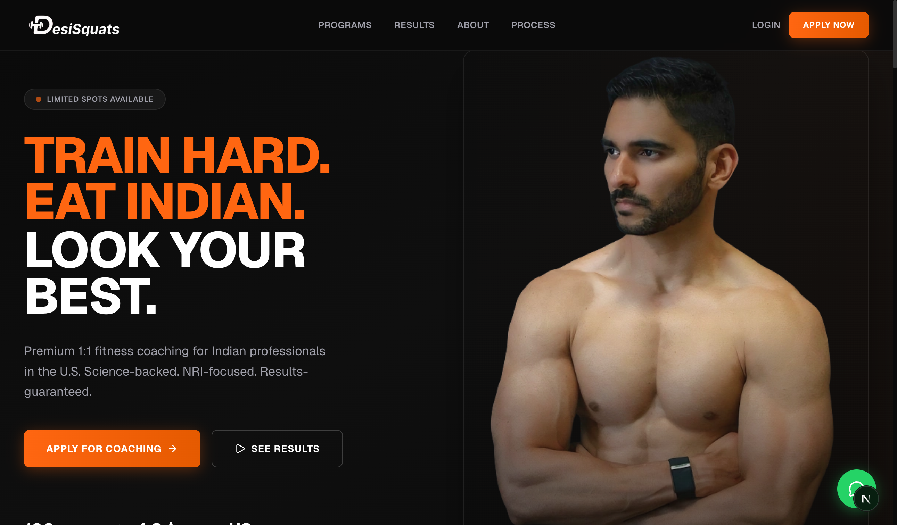
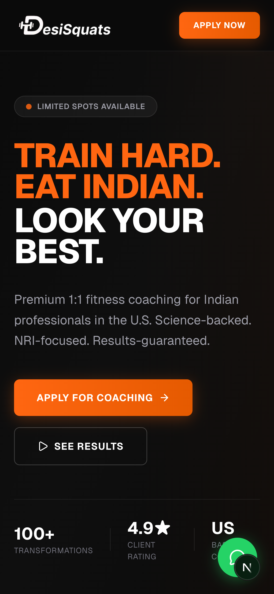

# Landing Page Screenshots

Screenshots of the DESISQUATS landing page for reference and sharing.

---

## Desktop View

### Above the Fold
The hero section with headline, CTA buttons, stats, and coach photo.

### Full Page
Complete landing page including hero, features, programs, testimonials, coach bio, process, and CTA.

---

## Mobile View (iPhone 14 Pro — 390×844)

### Above the Fold
Mobile hero with responsive layout, stacked content, and prominent CTA.

### Full Page
Complete mobile landing page scroll.

---

## Page Sections

| Section | What it shows |
|---------|--------------|
| Hero | Headline, tagline, CTA buttons, social proof stats |
| Features | "No crash diets", "No random workouts", "No giving up Indian food" |
| Why Different | Indian food friendly, US lifestyle ready, strength first, weekly accountability |
| Programs | Fat Loss, Muscle Gain, Desi Nutrition Reset, Full Transformation |
| Results | Client testimonials with photos and quotes |
| Coach | Bio, credentials, experience |
| Process | 4-step flow: Apply → Get Plan → Check In → Transform |
| Final CTA | "Ready to stop guessing?" with Apply Now button |
| Footer | Logo, nav links, Instagram, copyright |
